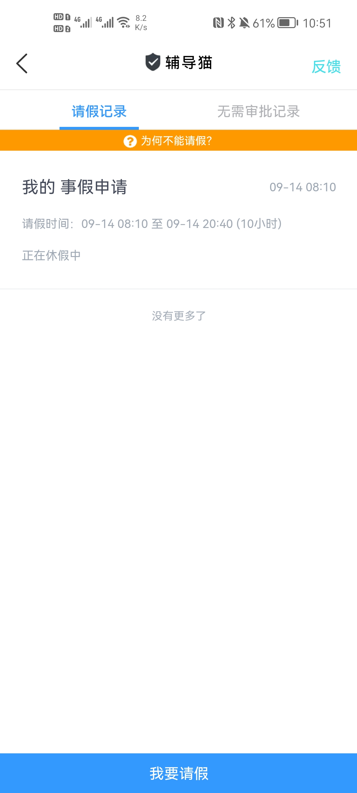
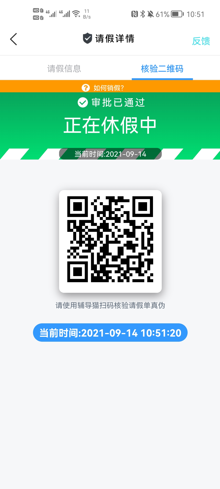

# **jingriqingjia**

##### 今日校园模拟请假软件(带核验码)

---

##  **使用须知**

##### 本软件使用[Uni-App](https://uniapp.dcloud.io/)编写

基于[ZeroMean/leave-school](https://github.com/ZeroMean/leave-school) 进行的再次开发

##### 软件仅供学习研究使用，请勿用于任何商业非法用途，否则造成任何后果作者概不负责！！！

请大家严格遵守学校和国家的相关规定，软件仅供学习研究使用，请勿用于商业及非法用途。

##  优化更新

2021-09-15更新内容:

-修改了时间缺少补位0的问题，修复请假时间换行问题
-删除 继续请假
-添加 目的地

2021-03-04 更新内容：

- 解决了右滑返回上一级的反人性化操作。
- 修复时间处理错误问题。
- 去除模拟签到功能。

2020-01-17 原作者版本未更新核验码功能，本次二开做出了以下优化：

- 优化使用界面，更加还原真实度。
- 增加核验码功能。

##  平台使用

支持安卓。安装包apk位置 \qingjiazhushou\unpackage\release\apk\__UNI__EC0148A__20210914102205.apk

## 软件截图

